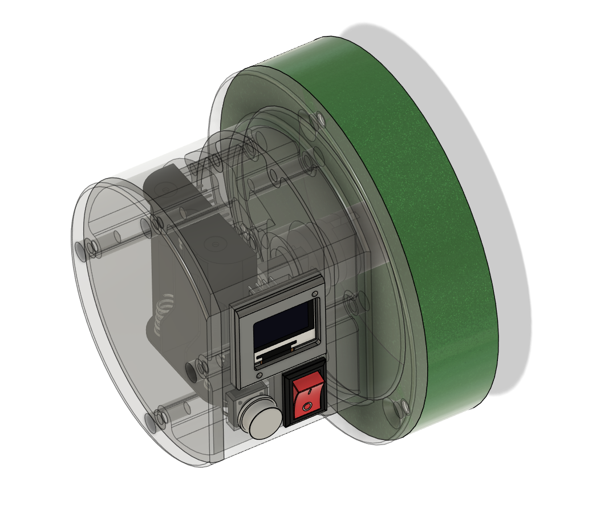
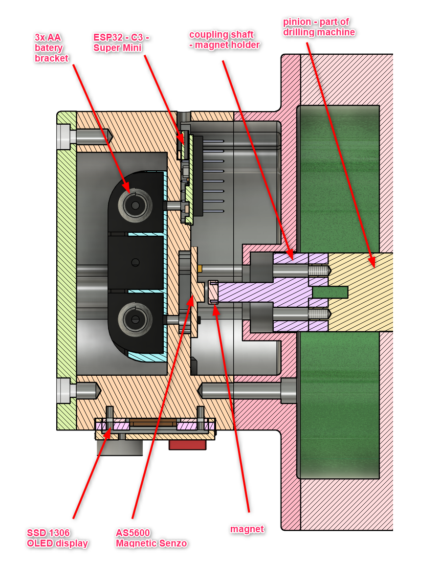
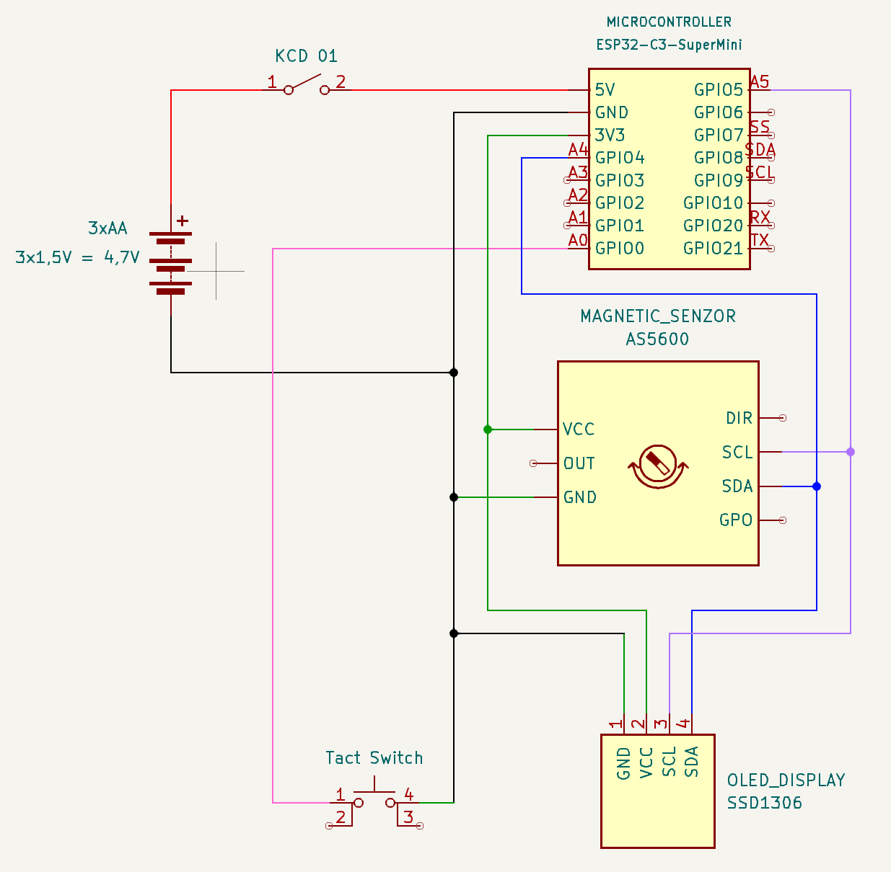
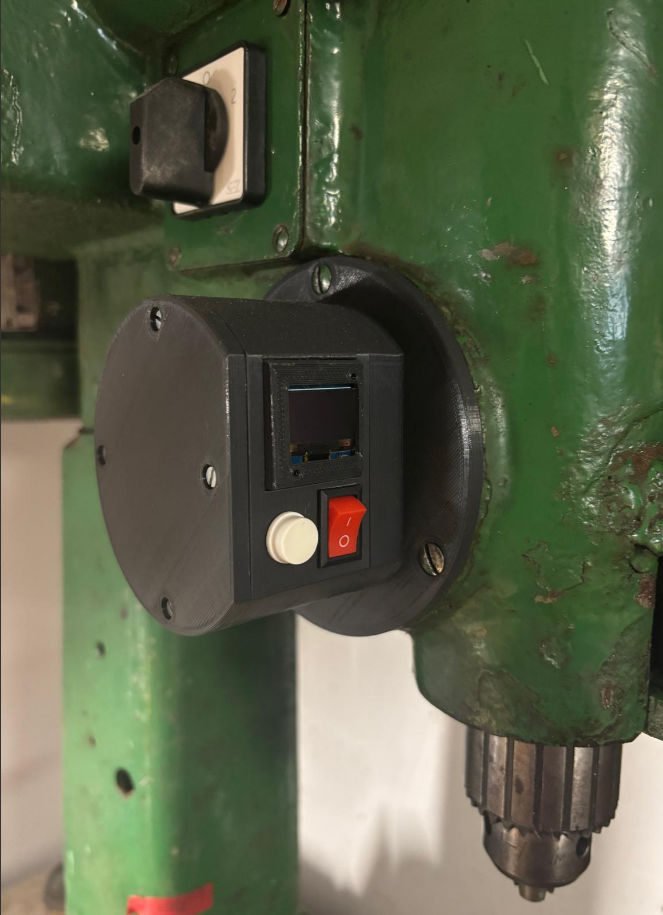

# DIY Hobby Project – Depth Drill Sensor

## Project Description
The goal of this project was to build a **depth measurement sensor** for a **drilling machine**.  
The device measures and displays the exact drilling depth in real time.  
It was designed as a low-cost DIY alternative to commercial depth gauges, using an **encoder-based sensing system**.  
This setup improves drilling accuracy when working with wood, plastic, or metal.

## Components Used
- 3x AA batteries, 1,5V  
- 3x AA battery bracket
- ESP32 - C3 - Super Mini
- AS5600 - magnetic senzor + MAGNET (diametrically magnetized)
- SSD1306 - 0.94 inch OLED display 
- OLED display (0.96" or 1.3") 
- KCD 01 switch
- Tact switch
- 3D printed parts
- jumper wires
- DuPont connectors

### Optional
- VeroBoard - for wiring

## Process

1. First step was to measure dimensions on existing machine and design a prototype. On pictures below are shown a default concept and cut through with positions for electric components. Pinion is a component of drilling machine with a fixed clock spring, which ensures a retraction. 

   Parts are made of PLA plastic and are 3D printed.

  

2. The wiring was done according to this scheme. 
  

3. After startup screen **Initialization**, there are 4 lines displaying on SSD 1306 OLED display in a format:

   <pre> 
    Total Length:  
                XX.YY mm  
    Offset Length: 
                XX.YY mm  </pre>

    This precision is enough for this project, since magnetic encoder is giving back a 4096 unique of its positions and this is recalculated via radius/distance to the pitch circle diameter (PCD), to this specific drilling machine.

    The math formula used:
    <pre> L = PCD * alpha </pre>, where the angle is in radians.  
   
      The complete code and explanation will be added in the future since, there is are used two separtate counters and total/offset depth are using this variables to calculate actual status.  
      
      Tact siwtch is for offset reset, and can be pressed anywhere.

## Results
The sensor provides continuous, accurate depth readings on the OLED display.  
Resolution depends on the encoder type and mechanical setup (typically **0.01–0.05 mm**).  
The system is stable, repeatable, and greatly improves precision in controlled-depth drilling operations for hobby work.

## Conclusion
This project demonstrates the practical use of an **encoder for position measurement** in a workshop setting.  
The depth drill sensor offers reliable and precise feedback for drilling operations and serves as a valuable tool for **prototyping, woodworking, and mechanical hobby work**.  

  

Future improvements may include:
- Adding **data logging**  
- **Bluetooth connectivity** for digital measurement recording  
- Automatic zero calibration  

---
