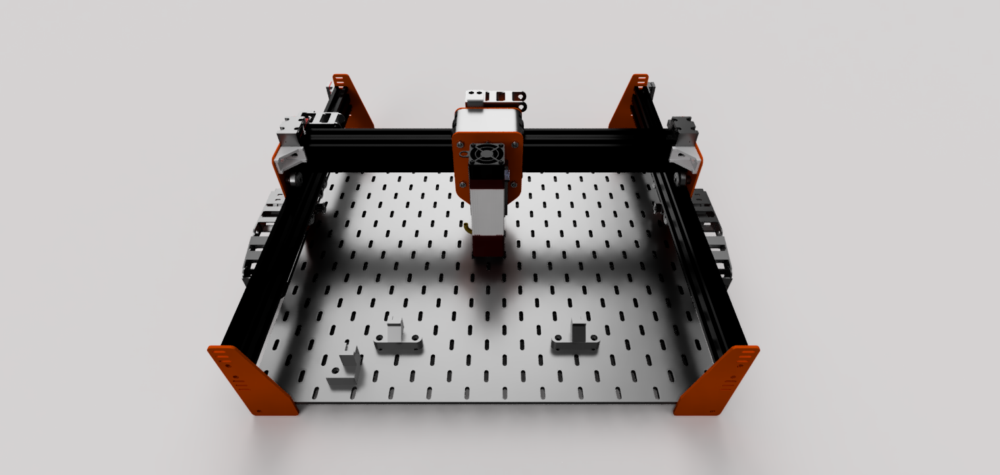
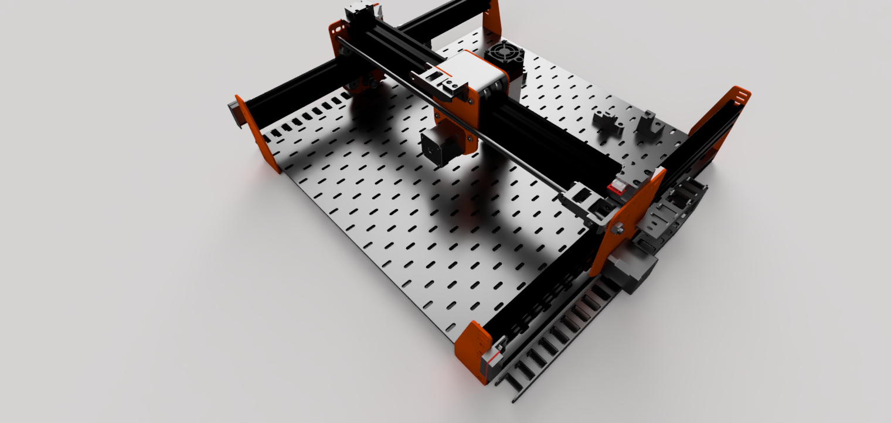

# DIY Hobby Project – Laser Engraver

## Project Description
The goal was to build a simple DIY laser engraver for hobby use. The project started from the need to mark and decorate small wooden and plastic parts. The machine was designed as a low-cost solution using easily available components.
Lasered parts can be found in folder in this project.

## Components Used
- CNC frame made from aluminum profiles
- Sheet metal plates as connecting parts   
- 3x - NEMA17 stepper motors
- Rollers, belt a pulleys
- Stainless steel support rod
- MKS DLC32 v2.1 control board
- LT-80W-AA-PRO (with noozle for assisting air)
- 24V power supply - 350W 
- Hailea ACO-380  
- Energy chain
- Fasteners
- 3D printed parts (fixtures)

## Process
1. Designed and assembled the frame from aluminum profiles.  
2. Installed stepper motors and linear guides.  
3. Wired the electronics and flashed the GRBL firmware.  
4. Tested motion using **Universal Gcode Sender**.  
5. Mounted the laser module and calibrated the focus.  
6. Performed first engraving tests on wood and plastic.  

## Results
The engraver can mark text, logos, and simple graphics on wood, plywood, or plastic.  
The maximum engraving area is approximately 450x400 mm. Accuracy is sufficient for hobby use and small custom projects.  

## Conclusion
This project was a great hands-on experience with building a CNC machine, working with stepper motors, and operating a laser. The engraver now serves as a hobby tool and a foundation for future experiments.
